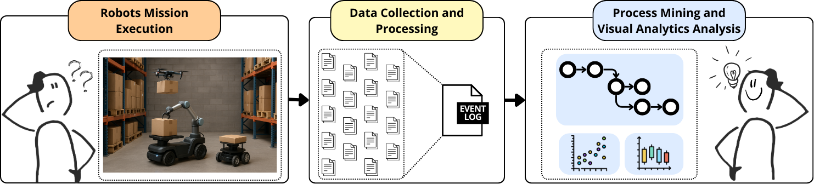
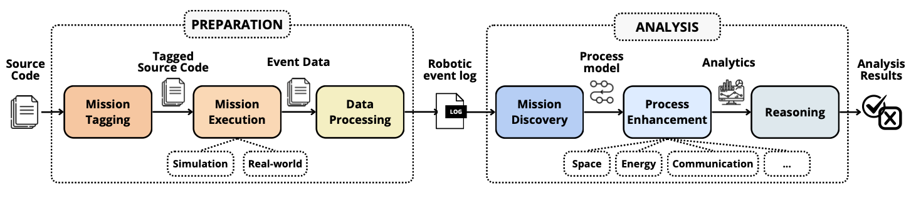

# Robot and Process Mining 

This repository provides tools for both data preparation and mission analysis of robotic systems.

* *Data Preparation*: A set of scripts automatically processes raw data collected during robot execution, converting it into structured event logs ready for process mining. These scripts are designed specifically for ROS-based systems, leveraging ROS as the standard for robot software development.

* *Mission Analysis*: The included RoboTrace tool supports process discovery and enhancement from multiple perspectives, enabling deep insights into robotic behavior and workflows via process mining.

Both components can be used independently or together, offering flexibility depending on your workflow needs.

## Methodology

The reference methodology aims to support the robotic developer in the automatic extraction of robotic event logs from the execution of a robotic system and analyze them through process mining.

The methodology has been designed to foster the application of process mining and the development of techniques suitable for robotic systems. It allows the system designer to specify tags in the source code and transform them into events to be inserted into the log. The generated event logs are enriched with multi-perspective information (as space, communication, and battery), thus defining a multi-perspective event log, suitable for the application of process mining techniques.

## Submodules
- **robot_data_preparation**: contains the scripts enabling the processing of robotic event logs [[repo](https://github.com/SaraPettinari/robot_data_preparation)].

- **robotrace**: contains the tool enabling multi-perspective analysis of robotic systems using process mining and visual analytics [[repo](https://github.com/SaraPettinari/robotrace/tree/main-2.0)].

## References
* Pettinari, S., Re, B., Rossi, L., Tiezzi, F. Enhancing Robotic Mission Analysis via Process Mining and Visual Analytics. (_under review_)

* Corradini, F., Pettinari, S., Re, B., Rossi, L., Tiezzi, F. (2024). A Methodology for the Analysis of Robotic Systems via Process Mining. In: Enterprise Design, Operations, and Computing. EDOC 2023. Lecture Notes in Computer Science, vol 14367. Springer. [[link](https://link.springer.com/chapter/10.1007/978-3-031-46587-1_7)]

